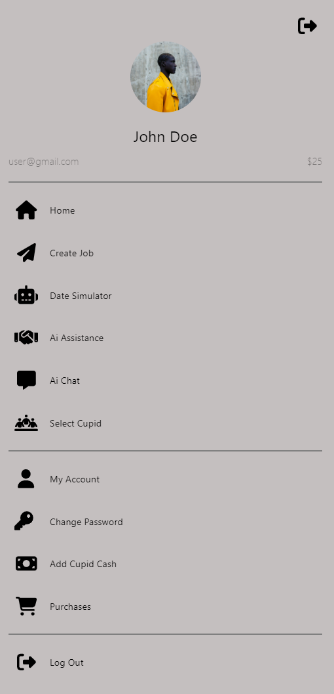

# Test Manual: Cupid Code
## Prerequisites
Please refer to the [README](../README.md) to set up the entire cupid code system before attempting to replicate any of the testing found here. Speicifically the Database needs to be set up and seeded before attempting the unit tests.  
All unit test files for the router and database are found in the directory `/server/tests/`  
To run the unit tests, from the terminal navigate to the project directory. Assuming all dependencies are installed, launch the docker container and reset the database using `yarn migrate-reset`. Then run the command `yarn tests-ui` It is expected that the first pass into unit tests will fail. Our testing time did not permit for perfectly agnostic unit tests. Auth tests needs to occur not at the same time as user.tests or it will fail as user tests will change the password and change it back, but auth will fail because it's token times out. Secondly purchases must occur after user.tests as their are changes made that are dependent on that test running. We acknowledge this is not ideal for unit tests, however given the limited time we have for development and that this is our first time unit testing a database, we have learned some things which will be noted below. If you are having issues, we recommend click on a test suite and running just that suite and then methodically going through the rest of the tests, they will all go green.   
Once the unit tests have all successfully passed, to view the coverage report from the web browser close the instance of `yarn tests-ui` run `yarn coverage` followed by `yarn tests-ui` again and the browser tab that is opened will run again and you will be able to view the interactive coverage report.
## The Journey
### In the beginning
Cupid code was a revolutionary app that asked the developers to build a database for a web based app that nerds could come to and receive quality advice from AI that was honed to help the user with dating relationships. Our team choose to work with React, Vite and Prisma. The combinations of these three frameworks made for tricky development at times given the JavaScript nature of react and TypeScript requirements of Vite and Prisma. The testing portion of the development process was limited in time and scope, us such we felt that the most stabilizing thing we could do was to lock down the Vite & Prisma API as fundamentally those were at a deliverable stage. This would allow us to keep moving the front end forward without fear of breaking other features in the app because we shifted something unexpectedly in the back end.  
While a reasonable idea we quickly realized that Vite was not just a light version of ExpressJS, we would need to find uncommon ways to hook up our back end to the unit test framework. We spent several man hours going down the rabbit hole of Mocha, Jest and other various frameworks and had limited success. Most wouldn't compile as they weren't truly TypeScript and those that were couldn't get passed the authentication stage of our backend. Thus we rolled into a conference the first of April where a presenter demonstrated their unit test framework ViTest, a Unit Test framework developed specifically for Vite, but had kept on the down low. We quickly implemented this framework and were up and running on the unit test development.
### Challenges along the way
- While we had a known framework that would compile and take care of our needs we still needed to access our own router to test API functionality of the Router and database. As such we had to develop our own automatic login in objects that would grant us access to the various API's in the system. Viewing the `cupid_user.ts` or `standard_user.ts` files will provide great insight as to how we overcame the logging in portion of the unit tests. By creating dummy objects that had the correct permissions we spoofed our own authentication system. We don't feel that this provided a vulnerability because all unit tests are things that a standard user or cupid could do from the app itself, and the login requires an email and password of an actual user.   
- As we developed we worked our way methodically down the files in the controller directories as those best represented the router and database connections that needed to be tied down. As we did so we found that our API's were returning correctly however because we were using 1 standard user and 1 cupid our tests are not actually independent of each other. The auth test tries to login while the user.test file is changing the password. The purchases table requires that the user tests be complete so that the database is in an acceptable state for the purchases tests. We here at Duckie corp regret to inform the consumer that our inexperience with databases is the shortcoming of these unit test designs and that given more time would redirect these changes such that the unit test would be agnostic of others. Auth should use an secondary user to validate that login. Purchases needs more help from the seed files to stabilize it such that a third standard user could be utilized to validate those unit tests. 
- On slower system the database can be overwhelmed by all the queries coming its way during the unit tests and thread lock trying to access the same object. Please allow a couple of reruns to the unit test if things feel. We here at ducky corp have exhaustively tested the unit tests, this will occur about 10% of the time on our systems. We expect similar results on other individual hardware, specifically if they have more then 4 cores to their machine. 
### Errors uncovered
Because we developed the front end and the back end together, there was not major issues uncovered during the unit test phase. The unit test written are more to solidify the design decisions that were made in coordination with the front end. If we had developed the back end before the front end it would have been more rigid to migrate with front end design changes. For example the customer requested a feature where the user would know how far their cupid is from them. If we had built the backend first, at the time of this request we would have finished the backend by this time. However because our development was full stack together we added it to the cupid design which was ongoing and it melted in. Contrast that if we had rigid API and had to develop the unit tests to change with it, the adaptation would have been hard. By closing with UnitTest we felt that we adapted quickly and have now solidified the product so that further development is deliberate and methodical. 
### Coverage Reports
From the terminal in the project directory, run the following command `yarn tests-ui`. A browser tab will be opened and after a completely successful unit test run, in the top left corner is a file icon that is labeled coverage by the ARIA tag. The relevant code coverage is found at the bottom of that page which the directories for the server is listed.   
  
We at Ducky Corp are proud to report that the server and database have reached the industry standard of 80% coverage on those files and are still actively developing unit tests to work towards the mythical 100% code coverage for the entire framework.
For those who are allergic to mice, one may stay in the terminal. The same command will generate a coverage report that will look like the following

## System Level Testing
### Validating the Front End
All talk thus far has been for backend parts of CupidCode. We have however been completing manual testing of the front end as our User Manual team has developed the documentation for demonstration. They have done so by booting up the entire system and navigating through the various work flows. Those flows have effectively allowed them to verify that the front end is well connected to the back end and that all UI and resources pulled from our systems or other user systems are adequately connected to the user interface. For example an early UI test that occurred during development was the functionality of side bar. Prior to the sidebar functionality all pages were navigable only through the address bar. An example of early testing was the usage of the nav bar where an individual would click on the hamburger menu

Doing so would bring out the following

Where we would test that each page was accessible and that all expected pages where listed. We also quickly realized that on smaller devices we had not implemented a way for the user to scroll on that side bar and as such some users couldn't log out. Testing called for that to be quickly implemented. 
### Further Testing Required 
The front end is completely untested from an automation perspective. Developers have been responsible for the front end development as they go. We do not have a simple program to point to the elements there that allow for validation of the front UI. We do however have further plans for such. With the conclusion of development we would like to utilize selenium to walk through the tests outlined in the demonstration as a minimum. Other workflows would still be required and developed as directed by the program manager. However automation testing cannot assess the presentability of the UI. Selenium parses the HTML doc looking for features, but makes no check that the features are rendered appropriately, thus regular manual testing is required so that the UI is validated before deployment is made. 