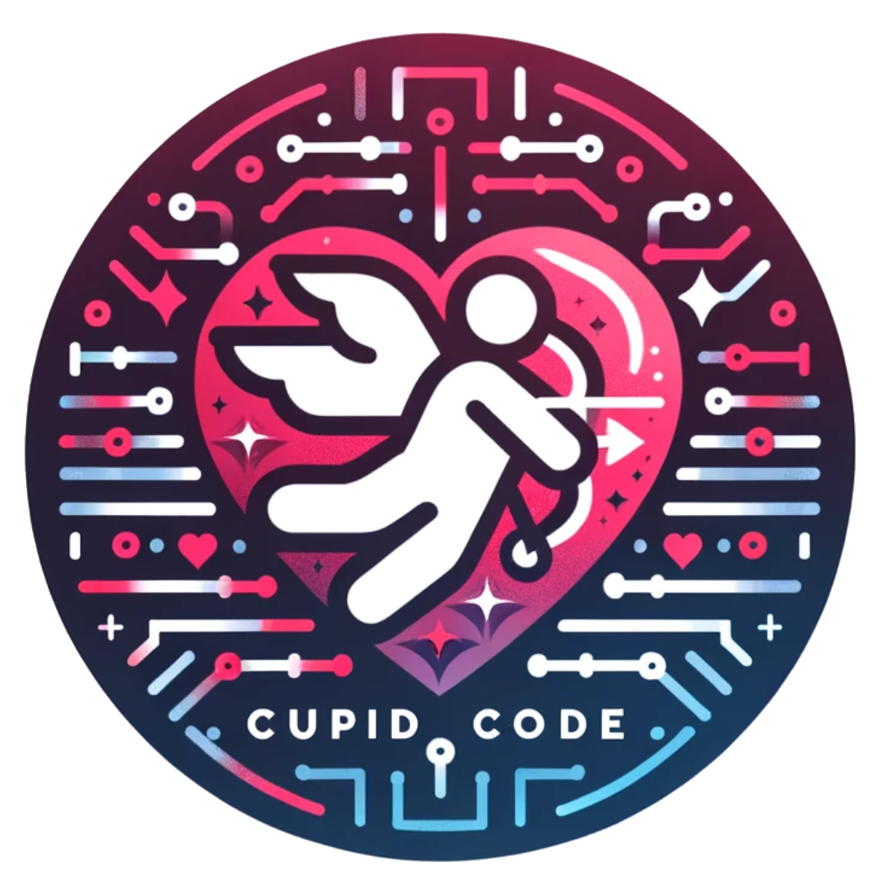
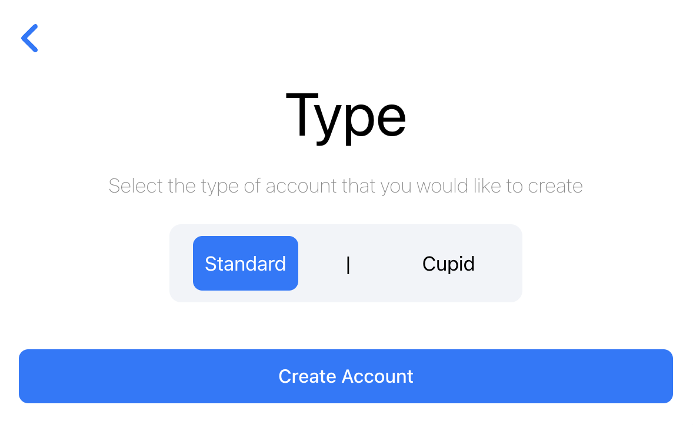

# Cupid Code User Manual

Welcome to the enchanting realm of Cupid Code, where the magic of AI meets the whimsy of romance! Are you a self-proclaimed nerd with a heart full of dreams and a date night dilemma? Fear not, for Cupid Code is here to sprinkle a little love-laced AI wisdom into your world.

Picture this: You're lost in a labyrinth of date ideas, unsure of where to begin. That's where Cupid Code swoops in like a digital wingman, ready to orchestrate your perfect evening with just a few taps. Simply share your desires with our AI cupid, and watch as it crafts a masterful plan complete with swoon-worthy activities and all the essentials your heart could desire.

But wait, there's more! Ever wished for a trusty sidekick to guide you through the maze of dating dos and don'ts? Cupid Code's live chat feature puts you in direct contact with our AI cupid, ready to dispense sage advice and witty banter at a moment's notice.

So, whether you're planning a cozy picnic under the stars or a daring adventure through the city streets, let Cupid Code be your digital wingman, transforming your nerdy fantasies into real-world romance.
## Table of Contents
- [User Sign-up](#user-sign-up)
- [Editing Account Information](#editing-account-information)
- [Adding Cupid Cash](#adding-cupid-cash)
- [Date Simulator](#date-simulator)
- [AI Assistance](#ai-assistance)
- [AI Chat](#ai-chat)
- [Selecting a Cupid](#select-cupid)
- [Frequently Asked Questions](#FAQ)

## User Sign-up
You need to create an account before you are able to use Cupid Code's features. From the sign-in page, navigate to the blue *Sign up* button located at the bottom of the sign-in page. Click it.

 

**Note:** You might need to scroll down to the sign-up option.

After clicking the sign-in button, you will see two options **Standard** and **Cupid**. Make your selection and then click *Create Account*. Your selection is highlighted in the blue box.

### Standard Account
Start by adding a picture of yourself by clicking the little camera icon. You will then be prompted select an image from your computer.  
**Developer Tip:** Select an image that will help cupids recognize you for smoother and faster interactions.

Continue filling out all your information. Please provide an email that you actively monitor for news and updates about your account. Remember to create strong password, see [Password Requirements](#password-requirements) for more information.

Ensure that you provide your relationship goals so that we can best serve you. Please make sure that your information is accurate before hitting *Sign Up*, though you can later change this information if needed.
### Cupid Account
Start by adding a picture of yourself by clicking the little camera icon. You will then be prompted select an image from your computer.  
**Developer Tip:** Select an image that will help users recognize you for smoother and faster interactions. Ensure that your profile picture is profession as you are representing Cupid Code.

Continue filling out all your information. Please provide an email that you actively monitor for news and updates about your account.  Remember to create strong password, see [Password Requirements](#password-requirements) for more information.

### Password Requirements
TODO: ADD requirements

## Editing Account Information
## Adding Cupid Cash
## Date Simulator
## AI Assistance
## AI Chat
## Selecting a Cupid
## FAQ