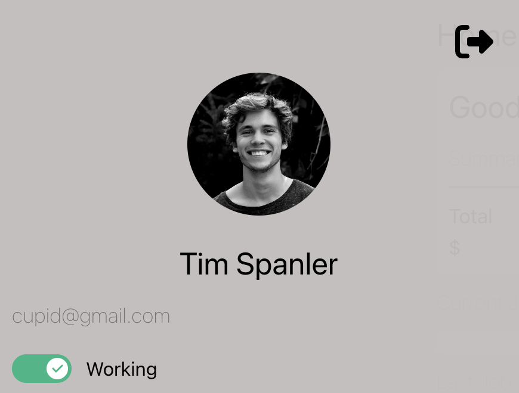

# Cupid Code User Manual

Welcome to the enchanting realm of Cupid Code, where the magic of AI meets the whimsy of romance! Are you a self-proclaimed nerd with a heart full of dreams and a date night dilemma? Fear not, for Cupid Code is here to sprinkle a little love-laced AI wisdom into your world.

Picture this: You're lost in a labyrinth of date ideas, unsure of where to begin. That's where Cupid Code swoops in like a digital wingman, ready to orchestrate your perfect evening with just a few taps. Simply share your desires with our AI cupid, and watch as it crafts a masterful plan complete with swoon-worthy activities and all the essentials your heart could desire.

But wait, there's more! Ever wished for a trusty sidekick to guide you through the maze of dating dos and don'ts? Cupid Code's live chat feature puts you in direct contact with our AI cupid, ready to dispense sage advice and witty banter at a moment's notice.

So, whether you're planning a cozy picnic under the stars or a daring adventure through the city streets, let Cupid Code be your digital wingman, transforming your nerdy fantasies into real-world romance.
## Table of Contents
- [Getting Started](#getting-started)
  - [Installation](#installation)
- [Standard Users](#standard-users)
  - [Create an Account](#creating-an-account)
  - [Editing Account Information](#editing-account-information)
  - [Adding Cupid Cash](#adding-cupid-cash)
  - [Date Simulator](#date-simulator)
  - [AI Chat](#ai-chat)
- [Cupids](#cupids)
  - [Cupid Sign-up](#cupid-sign-up)
  - [Toggle Availability](#toggle-availability)
  - [Start a Job](#starting-a-job)
    - [View Available Jobs](#view-available-jobs)
    - [Accepting a Job](accepting-a-job)
    - [Completing a Job](#completing-a-job)
- [Admin](#admin)
- [Troubleshooting](#troubleshooting)
- [Frequently Asked Questions](#FAQ)
- [Contact Information](#contact-information)

## Getting Started
### Installation

## Standard Users
### Creating an Account
You need to create an account before you are able to use Cupid Code's features. From the sign-in page, navigate to the blue *Sign up* button located at the bottom of the sign-in page. Click it.

 

**Note:** You might need to scroll down to the sign-up option.

After clicking the sign-in button, you will see two options **Standard** and **Cupid**. Make sure that **Standard** is selected, then hit *Create Account*.

Start by adding a picture of yourself by clicking the little camera icon. You will then be prompted select an image from your computer.  
**Developer Tip:** Select an image that will help cupids recognize you for smoother and faster interactions.

Continue filling out all your information. Please provide an email that you actively monitor for news and updates about your account. Remember to create strong password, see [Password Requirements](#password-requirements) for more information.

Ensure that you provide your relationship goals so that we can best serve you. Please make sure that your information is accurate before hitting *Sign Up*, though you can later change this information if needed.

### Editing Account Information

### Adding Cupid Cash
From the sidebar menu select **Add Cupid Cash**, as seen below.

You will then be directed to the form where you can enter your desired amount and your card information. Hit the **Add Cupid Cash** button at the top of the screen. Do not hit the **Add Cupid Cash** more than once even if there is an error message. Instead, reload the page and see if the payment went through.

### Date Simulator
From the sidebar menu select **Date Simulator**, as seen below.

#### First Step - Generating transcript
You will be prompted to enter your date description. Make sure to be specific and give good details for a better outcome. After entering your description, hit the **Generate Transcript** button. 

After a couple seconds, you will be provided with a sample transcript to help provide inspiration for sample talk on the date.

After reading through the transcript, hit **Generate job**.

#### Second Step - Generating the Job
After a couple of seconds, the potential job will appear. Please review this and make sure that you are satisfied before continuing.
If you are not satisfied return to **Step One** and edit your description. 

#### Third Step - Send to Cupid
Start be selecting a cupid from the drop-down menu under **Select Cupid**. After choosing your cupid tap the **Send to Cupid!** button. Although it might appear that nothing happened but rest assured that your job was sent.

### AI Chat
From the sidebar menu select **AI Chat**, as seen below.

Type in the text box and hit the blue arrow to send you message the AI. Depending on the connection, it might take a couple seconds to receive a response. 

Remember that your chat with the AI won't save and will be deleted once you leave the page. If you want to save some information please write it down else where. 

## Cupids 
### Cupid sign-up
You need to create an account before you are able to use Cupid Code's features. From the sign-in page, navigate to the blue *Sign up* button located at the bottom of the sign-in page. Click it.

 

**Note:** You might need to scroll down to the sign-up option.

After clicking the sign-in button, you will see two options **Standard** and **Cupid**. Make your selection and then click *Create Account*. Your selection is highlighted in the blue box.

Start by adding a picture of yourself by clicking the little camera icon. You will then be prompted select an image from your computer.  
**Developer Tip:** Select an image that will help users recognize you for smoother and faster interactions. Ensure that your profile picture is profession as you are representing Cupid Code.

Continue filling out all your information. Please provide an email that you actively monitor for news and updates about your account.  Remember to create strong password, see [Password Requirements](#password-requirements) for more information.

### Toggle Availability
At the top of the sidebar menu there is a toggle button to change availability status. The figure below shows the cupid active. To show your status as **off-line** tap the toggle button so that it is a gray color and red exit.

### Starting a Job
#### View Available Jobs
Start by making sure that your account is active. From the sidebar, navigate to the **Available Jobs** section, as seen below.

You will see a list of available jobs with the following information:
* User's name
* Job description
* Cupid payout

To view more information about a job hit the button **View** on the right side of the job box. This will display a bit more information that is important information like the location. 

#### Accepting a Job
To accept a job hit the **Start** button found below the **View** button. You will see the job will move to the **Current Jobs** section. 

#### Completing a Job
Once you have completed a job, hit the **Complete** button. The completed job will be removed from your **Current Jobs** section.

## Admin

## FAQ

### Password Requirements
- Must be at least 10 characters long
- Must contain at least one uppercase letter
- Must contain at least one number
- Must contain at least one symbol 
  - ex. !@#$%?&*

## Troubleshooting

## Contact Information
Please contact admin@cupid.com for:
* Reporting a cupid

Please contact support@cupid.com for:
* Customer service
* Reporting a bug
* Cupid cash refunds
* All other needs